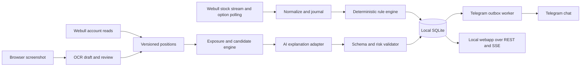

# Architecture and data

## Proposed implementation

Use a Python 3.12 service with FastAPI, the official Webull Python SDK behind an adapter, a React/TypeScript frontend, and SQLite on local disk. These are design choices, not dependencies installed in this repository. Pin supported versions after an integration smoke test. Prefer standard SDK authentication over implementing request signing from scratch. [Webull SDK](https://developer.webull.com/apis/docs/sdk/)

Serve the compiled UI and HTTP API from one origin, `http://127.0.0.1:8787`. Use Server-Sent Events (SSE) for browser updates and ordinary REST for mutations. Browser closure does not stop collection. MVP runs one supervised backend process with isolated async workers, one database writer, and a bounded intake queue. OCR/model calls run in a constrained worker/executor so they cannot stall feed processing. A second process for ingestion is the first scaling step, not an MVP dependency.

The engine, UI, model, and broker access are separate modules. Model outputs cannot invoke HTTP tools, alter rules, commit positions, or submit orders. The Webull adapter exposes only a read allowlist plus market subscriptions and authentication methods.

## Network-drive constraint

This repository is at `W:\dev\whale rider`, backed by a network share. Use host-local runtime storage such as `%LOCALAPPDATA%\WhaleRider`; on Linux use a local application data directory. The storage is physically attached to the host, as confirmed by the user. Run the database through that host's native local path; avoid the SMB access path used by this workspace. SQLite documents that WAL requires shared memory and does not work over a network filesystem. [SQLite WAL](https://www.sqlite.org/wal.html)

The implementation should resolve filesystem type before startup and reject a network path for runtime storage. Completed encrypted backup files may be copied to the share. Git and documentation can remain here.

## Processing and durability

1. Adapter produces versioned envelopes with source, instrument, provider event/report time, receive time, payload hash, and provenance.
2. Validate type/units and journal the normalized batch through the single writer.
3. Rule worker consumes journal offsets in event-time order within a bounded reorder window.
4. One transaction writes alert events, evidence references, cooldown/window changes, outbox items, and the committed processing offset.
5. SSE emits committed changes only. Reconnect uses last event ID and a snapshot fallback.
6. Outbox worker leases pending deliveries and records attempts, response classification, and next attempt time.

Use a 10,000-event bounded in-memory queue. At capacity, stop optional enrichment first; if intake still exceeds capacity, mark a data gap and pause completeness-dependent rules. Do not silently drop data. A crash before journal commit can lose received events; use bounded provider recovery where supported and surface unrecoverable intervals.

Persist raw provider envelopes only in an optional short-lived capture mode with licensed storage rights. Normalized retained events support replay; aggregate/prune older data. The database journal is not a claim of lossless market capture.

## Time and identity

Store UTC timestamps at the finest trustworthy source precision; retain the original unit/value. Display America/New_York using an exchange calendar for sessions, DST, holidays, early closes, and contract-specific expiry time. Keep event, report, receipt, decision, and send times distinct.

Prefer stable provider execution IDs with source/session scope. The fallback hash of symbol/time/price/size/side is **not unique**: two real prints can match exactly. Use transport packet identity for true retransmissions where available; preserve multiplicity within each batch. REST overlap without IDs uses multiset reconciliation over stable ordered windows only after validation. If ambiguous, flag identity quality and disable repeat/cluster rules; never silently collapse identical economic trades. Feed sources are not merged as one tape without cross-source identity.

Correction/cancel records reference the original execution when supported. Recompute affected aggregates and mark/retract linked alerts, optionally sending a correction message. If the feed does not expose corrections, mark that limitation in quality metadata.

## Logical data model

All IDs are opaque UUIDs except locally generated monotonic processing offsets. Financial numbers use decimal strings in API/JSON and exact decimal arithmetic; store fixed-scale integers or validated decimal text, never binary floating point for money.

| Entity | Important fields and constraints |
| --- | --- |
| instrument | provider mapping, asset type, underlying, expiry, strike, put/call, price multiplier, deliverable, adjustment state; identity unique |
| capability_report | environment, version, access state, feed coverage, verified fields, measured cadence, evidence date |
| watchlist_member | instrument ID, priority, pinned, requested cadence, actual cadence, subscription status |
| market_event | offset, provider ID nullable, type, instrument, event/receive times, price, quantity/unit, quality, correction link, dedup quality |
| quote_observation | instrument, provider time, bid/ask/size, feed scope, age; optional trade association |
| rule / rule_version | stable rule ID, immutable validated expression, universe, sessions, thresholds, cooldown, destination, revision, enabled |
| rule_state | rule version + instrument + session, aggregates, watermark, last trigger and escalation value |
| alert_event | ID, rule version, evidence offsets, observed facts, inference, severity, quality, created/expired/retracted time |
| delivery / delivery_attempt | alert+destination unique; pending/leased/sent/retry/unknown/expired/dead state; message ID, attempts, due time |
| account / balance_snapshot | alias, provider ID encrypted/reference, currency, equity, cash, buying power, source and freshness |
| position_snapshot / position_row | account, version, as-of, source, completeness, instrument, signed quantity, cost, lineage, verified status |
| import_job / import_row | image hash/path, capture time, schema/model version, OCR draft, field confidence, corrections, status |
| suggestion_run / candidate | input snapshot IDs, rule/model version, evidence IDs, deterministic calculations, status, expiry, explanation |
| audit_event | actor, action, object/version, redacted change, timestamp, correlation ID |
| settings / secret_reference | policy values and vault key references only; no plaintext keys in regular tables |

Indexes: events by instrument/event time and receive offset; alerts by creation/severity; deliveries by state/next-attempt; positions by account/version; rule versions by stable ID/revision. Unique outbox key prevents duplicate scheduling, not exactly-once delivery by an external network.

## Delivery semantics

`pending → leased → sent`; transient rejection becomes `retry_wait`; permanent destination/auth error becomes `dead`; aged trade alerts become `expired`.

A timeout after sending may mean Telegram accepted the message. Mark `unknown`, then permit at most one automatic retry within expiry with the same visible alert ID and a 'possible repeat' marker. Exactly-once external delivery cannot be guaranteed because the send API has no application idempotency key. Lease expiry after a crash has the same ambiguity. Administrative retries are audited.

Group nearby notifications by underlying/rule family before delivery, retain child evidence IDs, and use priority aging to prevent indefinite starvation. Health messages are coalesced and share the overall rate cap.

## Application API contract

These paths belong to Whale Rider, not Webull.

| API | Behavior |
| --- | --- |
| GET /api/v1/health | Liveness; readiness endpoint adds dependency states and ages |
| GET /api/v1/capabilities | Verified/unknown/disabled features and monitoring coverage |
| GET/POST /api/v1/rules | List/create; validate permitted operators and required data |
| PATCH /api/v1/rules/{id} | Create next revision using If-Match; stale revision returns 409 |
| POST /api/v1/rules/{id}/simulate | Evaluate retained/synthetic events with external sends disabled |
| POST /api/v1/rules/{id}/pause | Pause until time or indefinitely; audit actor/reason |
| GET /api/v1/alerts | Cursor pagination, symbol/severity/state filters |
| POST /api/v1/alerts/{id}/acknowledge | Local acknowledgement; does not imply a trade |
| GET /api/v1/positions | Versioned snapshot, source, freshness, completeness |
| POST /api/v1/positions/refresh | Queue account read and reconciliation |
| POST /api/v1/imports | Multipart image upload; limits and metadata; returns 202/job ID |
| PATCH /api/v1/imports/{id}/rows | Review/correct draft with revision check |
| POST /api/v1/imports/{id}/commit | Expected position version, explicit deltas, idempotency key; atomic commit |
| POST /api/v1/suggestions | Snapshot/version and objective; returns 202/run ID |
| GET /api/v1/suggestions/{id} | Candidates or abstention with calculation lineage |
| POST /api/v1/settings/telegram/test | Explicit test to configured destination; no hidden send on save |
| GET /api/v1/events | SSE: alert.created, delivery.updated, positions.changed, health.changed |

Errors use `code, message, details, correlation_id`. Jobs support queued/running/succeeded/failed/cancelled; cancellation discards late results. Mutations require session authentication, CSRF protection and origin checking; imports/commits use idempotency keys scoped to account and operation.

## Proposed future repository layout

`backend/adapters/{webull,telegram,ai}/`, `backend/domain/{alerts,positions,risk}/`, `backend/api/`, `backend/workers/`, `frontend/`, `migrations/`, `tests/{unit,contract,integration,replay,e2e,evals}/`. This document does not create an untested production scaffold.
