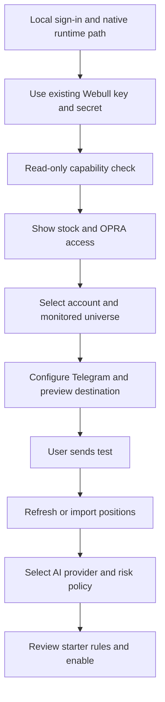
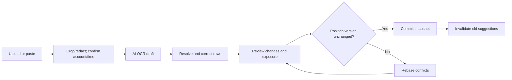

# Webapp layout and flows

## Navigation and visual design

Desktop-first workspace, responsive for a narrow browser. Persistent left navigation: Overview, Alert rules, Positions, Suggestions, History, Settings. Header: selected account, session clock, live/polled/delayed/replay status, monitoring coverage, and pause control.

Dark navy background, neutral elevated panels, tabular numerals, readable 14–16px body text, restrained teal/amber/red states. Color never carries status alone. 'Large' is neutral, not bullish. Tables support keyboard focus and sorting; details open alongside the list.

Reference grid: 232px sidebar, 24px gutters. Dashboard uses a two-thirds event list and one-third exposure/health column. Below 1100px, stack panels; below 760px, compact navigation and event cards. Maintain WCAG AA contrast targets, visible focus, semantic labels, reduced motion, and announced save/error states.

## Overview wireframe

```text
+--------------------------------------------------------------------------+
| Whale Rider | Account | 10:31 ET | Stocks live / Options polled | Pause    |
+-------------+------------------------------------------------------------+
| Overview    | Monitored 20 stocks / 6 contracts | Delivery | Positions age |
| Alert rules |------------------------------------------------------------|
| Positions   | Recent large trades                 | Current exposure     |
| Suggestions | NVDA 80k shares · $12m · 0.6s old    | Net delta by name    |
| History     | NVDA 155C · $130k · polled 8s late   | Missing metrics      |
| Settings    | [Inspect evidence] [Snooze symbol]  | [Review positions]   |
|             |-------------------------------------+----------------------|
|             | Event detail / why it fired         | Feed + queue health  |
+-------------+------------------------------------------------------------+
```

Events show price/size/dollars, asset, contract, execution time, observation delay, inference quality, rule, holding relevance and delivery status. Detail exposes source coverage, quote alignment, suppressed related triggers and corrections.

Pause defaults to notification delivery, with separate explicit controls for evaluation and monitoring. Expired urgent messages remain in history rather than flooding Telegram after resume.

## Screens

| Screen | Main content and actions | Empty/error states |
| --- | --- | --- |
| Overview | Events, universe, name/delta exposure, health, quick create | 'No matching events' differs from 'Disconnected' and 'No coverage' |
| Alert rules | Templates, search, enabled state, last trigger, edit/duplicate/archive | Missing OPRA or required fields shows capability reason |
| Rule editor | Scope → conditions → noise/routing → preview/test → activate | Show effective polling cadence and missing coverage before saving |
| Positions | Holdings, source/time/version, balances, API refresh, screenshot/manual entry | Empty account differs from failed account read; conflicts preserve both versions |
| OCR review | Image crop, editable rows, validation, before/after diff, commit | Ambiguous identity/sign/date blocks commit |
| Suggestions | Objective, policy summary, alternatives, before/after exposure, evidence | 'No valid action' includes reason and next step |
| History | Trigger/suppression/delivery filters, timeline, replay | Retention boundary and replay mode explicit |
| Settings/Health | Webull, Telegram, AI, privacy, storage, risk limits, backup | Independent connected/degraded/unavailable states |

A small price-context plot can use verified retained bars. A full trading terminal is outside MVP; omit charts when data is insufficient.

## First-run flow



Monitoring may start with available capabilities while AI setup is incomplete. A setup checklist identifies which requested functions remain unavailable.

## Create/manage an alert

Choose template → set instruments → thresholds/units/session → review cadence/dependencies → cooldown/quiet hours/destination → preview → dry-run → save draft or enable.

Dry-run shows matched/rejected examples and reason codes with the available-history duration. Do not extrapolate notification volume from inadequate history. Editing retains prior versions; duplicate starts disabled; archive preserves historical evidence; snooze has an expiration.

## Screenshot flow



Display 'Partial update: unshown positions remain'. Explicit closing appears in the diff, separate from omission. Failure/cancellation/retry preserves drafts.

## Event-to-suggestion flow

Inspect event → Review impact → refresh/reconfirm positions → select objective → deterministic candidates → AI explanation → validated cards.

Cards show legs/quantity, conditions, debit, defined or planned risk, before/after exposure, evidence, uncertainty and expiry. Actions: Save idea, Dismiss, Recalculate, Copy details. No trade-execution button.

## Failure flows

- Feed disconnected: preserve history, remove live status, show last healthy time and gap.
- Options inaccessible: show OPRA/access requirement and disable dependent rules.
- Oversized scope: present achievable interval and narrowing controls; no silent omission.
- Telegram rejected: retain local alert and show retry/error class.
- AI unavailable: deterministic facts remain; allow retry.
- Stale/incomplete positions: block sizing; offer refresh/review.
- Closed market: show next scheduled session; lack of trades alone does not mean feed failure.
- Expired idea: preserve context but require recalculation.

Telegram messages include readable facts and an alert ID. A localhost link is not useful from a phone; omit it unless a reachable authenticated app URL is configured.

## Interactive preview

[Open the prototype](../prototype/index.html). It demonstrates hierarchy, rule editing, synthetic OCR review and exposure-aware suggestions. It is an interaction artifact, not evidence of implemented APIs, OCR, delivery or production risk controls.
